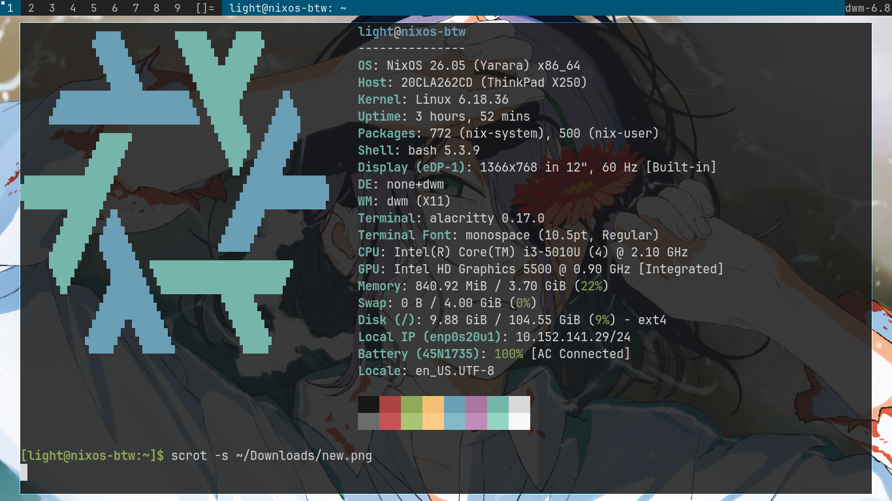

# NixOS dotfiles

**Here we go again!**

Here lies my NixOS plus dwm desktop setup config file, check'em out and pick your favourites!

## Start

Since I use [Flakes](https://wiki.nixos.org/wiki/Flakes) and [Home Manager](https://wiki.nixos.org/wiki/Home_Manager) for NixOS configuration setup, you could just clone this repository and run the `nixos-rebuild` command with `--flake` arguments to copy all my configs:

```bash
sudo nixos-rebuild switch --flake ~/nixos-dotfiles#nixos-btw
# change ~/nixos-dotfiles to where you store this repo, and nixos-btw to your machine's hostname.
```

## Preview


