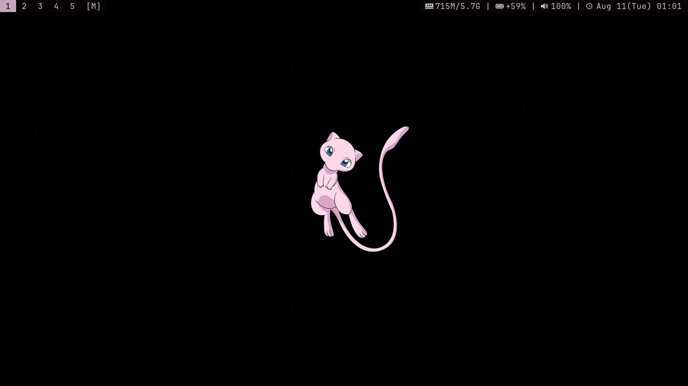

# NixOS dotfiles

**Here we go again!**

Here lies my NixOS plus dwm desktop setup config file, check'em out and pick your favourites!

## Start

Since I use [Flakes](https://wiki.nixos.org/wiki/Flakes) and [Home Manager](https://wiki.nixos.org/wiki/Home_Manager) for NixOS configuration setup, you could just clone this repository and run the `nixos-rebuild` command with `--flake` arguments to copy all my configs:

> [!CAUTION]
> I suppose you've already have a freshly installed NixOS running.

After installed NixOS:

### Clone this Repository

```bash
git clone https://github.com/lightmon233/nixos-dotfiles.git
```

### Copy your own hardware-specified config file

```bash
sudo cp /etc/nixos/hardware-configuration.nix ~/nixos-dotfiles/ # assume you've placed that repo under your home directory, same as below.
```

### Rebuild your configuration

```bash
sudo nixos-rebuild switch --flake ~/nixos-dotfiles#nixos-btw
# change nixos-btw to your machine's hostname.
```

### Reboot your computer

```bash
reboot
```

## Preview



## To-DO List

- [ ] Fix synchronous issue with Mod+Shift+N wallpaper changing hotkey.
