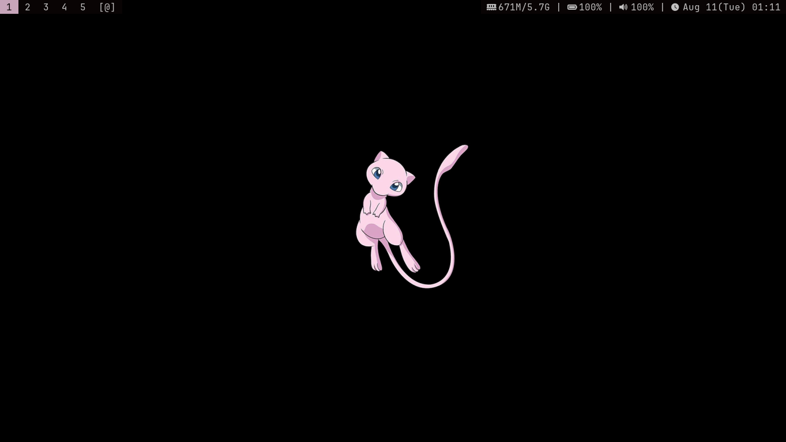
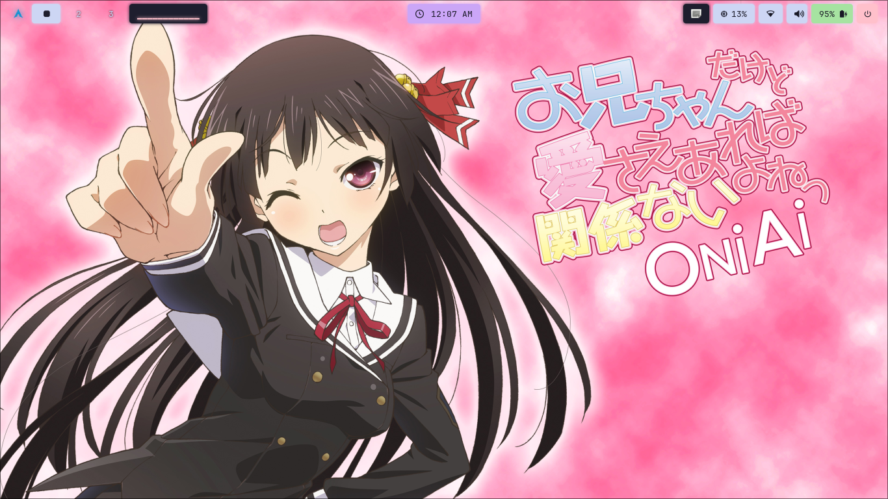

# NixOS dotfiles

**Here we go again!**

Here lies my NixOS plus dwm(now with hyprland added) desktop setup config file, check'em out and pick your favourites!

## Start

Since I use [Flakes](https://wiki.nixos.org/wiki/Flakes) and [Home Manager](https://wiki.nixos.org/wiki/Home_Manager) for NixOS configuration setup, you could just clone this repository and run the `nixos-rebuild` command with `--flake` arguments to copy all my configs:

> [!CAUTION]
> I suppose you've already have a freshly installed NixOS running.

After installed NixOS:

### Clone this Repository

```bash
git clone https://github.com/lightmon233/nixos-dotfiles.git
# copied to home directory for example.
cd ~/nixos-dotfiles

```

### Copy the default configuration

```bash
# make a folder under `hosts/`, with its name being your hostname
mkdir hosts/<your-hostname>
# copy the `default.nix` file
cp hosts/nixos-btw/default.nix hosts/<your-hostname>/default.nix
```

### Copy your own hardware-specified config file

```bash
sudo cp /etc/nixos/hardware-configuration.nix ~/nixos-dotfiles/<your-hostname>/hardware-configuration.nix # assume you've placed that repo under your home directory, same as below.
# or generate one if you don't have
sudo nixos-generate-config --show-hardware-config > hosts/<your-hostname>/hardware-configuration.nix
```

### Add your hostname config to the flake

```nix
nixos-btw = nixpkgs.lib.nixosSystem {
  system = "x86_64-linux";
  modules = [
      ./hosts/nixos-btw
      home-manager.nixosModules.home-manager
      {
          home-manager = {
              useGlobalPkgs = true;
              useUserPackages = true;
              users.light = import ./home.nix;
              backupFileExtension = "backup";
          };
      }
  ];
};
```

Copy and paste the code above according to the original structure in `flake.nix`, and rename `nixos-btw` to your own hostname.

### Add new config to the git repository

Under repo's root path:
```bash
git add .
# git commit # if you want to commit it
```

### Rebuild your configuration

```bash
sudo nixos-rebuild switch --flake ~/nixos-dotfiles#<your-hostname>
# change nixos-btw to your machine's hostname.
```

### Reboot your computer

```bash
reboot
```

## Preview

### DWM



### Hyprland


## To-DO List

- [ ] Fix synchronous issue with Mod+Shift+N wallpaper changing hotkey.
- [ ] Remove `configuration.nix` under root path cause it's not used any more.
